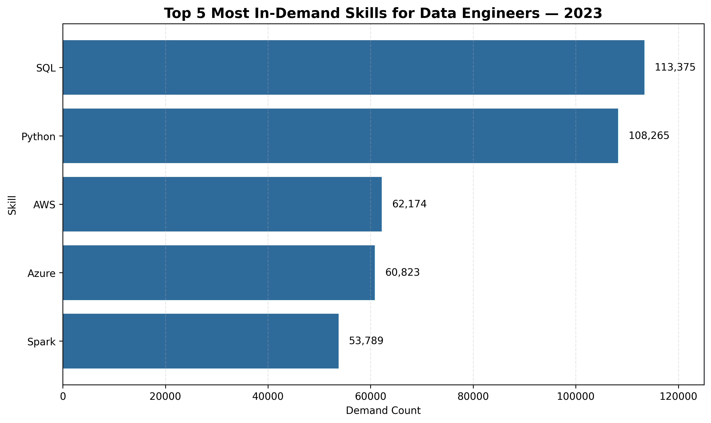
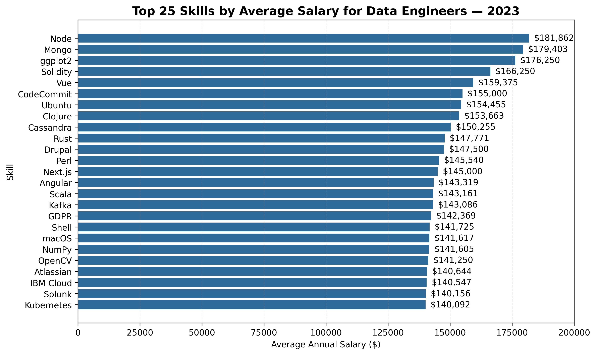
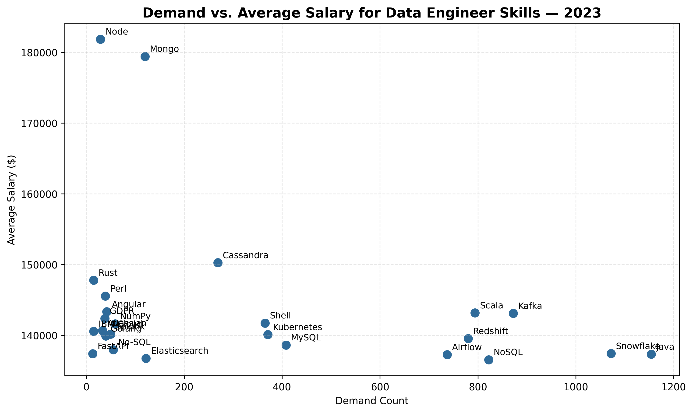

# Introduction

As organizations increasingly rely on data, Data Engineers play an important role in building the infrastructure behind it. This analysis examines Data Engineer job postings from 2023 to explore salary levels, employer demand, and the technical skills most frequently associated with these roles.

# Background

This analysis is based on a project from [Luke Barousse's SQL course](https://www.lukebarousse.com/sql), which uses job posting data to explore the data job market. Using the original analysis as a foundation, I explored the Data Engineering job market.

The dataset contains job postings from 2023, including information on job titles, salaries, locations, companies, and required skills.

The analysis addresses the following questions:

1. What were the top-paying data engineering jobs in 2023?
2. What skills were required for the top-paying data engineering jobs in 2023?
3. What skills were most in demand for data engineers in 2023?
4. Which skills were associated with higher salaries in 2023?
5. Which skills offered the best combination of demand and salary in 2023?

# Tools I Used

- **SQL** - Data analysis
- **PostgreSQL** - Database management
- **Python** - Data visualization with Pandas and Matplotlib
- **Visual Studio Code** - Development environment
- **Git & GitHub** - Version control and project documentation

# The Analysis

The SQL queries used for the analysis are available in the [project_sql](/project_sql/) folder.

### 1. What were the top-paying data engineering jobs in 2023?

Identify the 10 highest-paying Data Engineering job postings in 2023 with available salary information.

```sql
SELECT jpf.job_id,
       jpf.job_title,
       cd.name AS company_name,
       jpf.job_location,
       jpf.job_schedule_type,
       jpf.salary_year_avg,
       jpf.job_posted_date
FROM job_postings_fact jpf
LEFT JOIN company_dim cd ON jpf.company_id = cd.company_id
WHERE jpf.job_title_short = 'Data Engineer'
    AND jpf.salary_year_avg IS NOT NULL
ORDER BY jpf.salary_year_avg DESC,
         jpf.job_id
LIMIT 10;
```

**Results**

| Job Title | Company | Location | Salary ($) |
|---|---|---|---:|
| Hybrid - Data Engineer - Up to $600k | Durlston Partners | New York, NY | $525,000 |
| Data Engineer (L4) - Games | Netflix | New York, NY | $450,000 |
| Hybrid - Data Engineer | Durlston Partners | New York, NY | $425,000 |
| Hybrid - Data Engineer - Up to $500k | Durlston Partners | New York, NY | $400,000 |
| Data Engineer | Greenfield Source | — | $390,000 |
| Data Engineer | Algo Capital Group | — | $375,000 |
| VP, Data Engineer Epoch | TD Bank | New York, NY | $375,000 |
| Data Engineer | Algo Capital Group | Chicago, IL | $375,000 |
| Lead Macro Data Engineer | Long Ridge Partners | — | $375,000 |
| Data Engineer | Algo Capital Group | — | $375,000 |

**Findings**

The top 10 highest-paying Data Engineering job postings in 2023 offered average annual salaries ranging from $375,000 to $525,000. New York was the most common location among postings with available location data.

### 2. What skills were required for the top-paying data engineering jobs in 2023?

Identify the skills associated with the 10 highest-paying Data Engineering job postings.

```sql
WITH top_paying_jobs AS
    (SELECT jpf.job_id,
            jpf.job_title,
            cd.name AS company_name,
            jpf.salary_year_avg,
            jpf.job_posted_date
     FROM job_postings_fact jpf
     LEFT JOIN company_dim cd ON jpf.company_id = cd.company_id
     WHERE jpf.job_title_short = 'Data Engineer'
         AND jpf.salary_year_avg IS NOT NULL
     ORDER BY jpf.salary_year_avg DESC,
              jpf.job_id
     LIMIT 10)
SELECT top_paying_jobs.*,
       sd.skills AS skill_name
FROM top_paying_jobs
INNER JOIN skills_job_dim sjd ON top_paying_jobs.job_id = sjd.job_id
INNER JOIN skills_dim sd ON sjd.skill_id = sd.skill_id
ORDER BY top_paying_jobs.salary_year_avg DESC;
```

**Results**

| Job Title | Company | Salary ($) | Skills |
|---|---|---:|---|
| Hybrid - Data Engineer - Up to $600k | Durlston Partners | $525,000 | Python, C++ |
| Data Engineer (L4) - Games | Netflix | $450,000 | SQL, Python, Scala, Java, AWS, Spark, Excel |
| Hybrid - Data Engineer | Durlston Partners | $425,000 | Python |
| Hybrid - Data Engineer - Up to $500k | Durlston Partners | $400,000 | Python |
| Data Engineer | Greenfield Source | $390,000 | Python, Go, Linux, Excel |
| Data Engineer | Algo Capital Group | $375,000 | SQL, Python, MongoDB, Kafka, Linux, Kubernetes, Docker |
| VP, Data Engineer Epoch | TD Bank | $375,000 | SQL, Python, NoSQL, Azure, Databricks, Spark, PySpark, Kafka, Git, Flow |
| Data Engineer | Algo Capital Group | $375,000 | Python, Java, AWS, Airflow, Linux, Docker |
| Lead Macro Data Engineer | Long Ridge Partners | $375,000 | SQL, Python, C++, PostgreSQL, SQL Server, AWS, Redshift, Unix, Linux, Splunk, Jenkins, Kubernetes, Docker |
| Data Engineer | Algo Capital Group | $375,000 | SQL, Python, MongoDB, Kafka, Linux, Kubernetes, Docker |


**Findings**

Python was required across all 10 of the highest-paying job postings, followed by SQL, which appeared in 5 postings. AWS, Linux, and Docker were also frequently requested, each appearing in 4 postings. The results also show that higher-paying positions often required a combination of programming languages, cloud platforms, databases, and data engineering tools.

### 3. What skills were most in demand for data engineers in 2023?

Identify the top 5 most in-demand skills by counting how many Data Engineer job postings mentioned each skill in 2023.

```sql
SELECT sd.skills AS skill_name,
       COUNT(sjd.job_id) AS demand_count
FROM job_postings_fact jpf
INNER JOIN skills_job_dim sjd ON jpf.job_id = sjd.job_id
INNER JOIN skills_dim sd ON sjd.skill_id = sd.skill_id
WHERE jpf.job_title_short = 'Data Engineer'
GROUP BY sd.skills
ORDER BY demand_count DESC
LIMIT 5;
```

**Results**

| Skill | Demand Count |
|---|---:|
| SQL | 113,375 |
| Python | 108,265 |
| AWS | 62,174 |
| Azure | 60,823 |
| Spark | 53,789 |

*The chart below visualizes the relative demand for these skills.*


**Findings**

SQL and Python were the most in-demand skills, appearing in 113,375 and 108,265 job postings respectively. Cloud skills such as AWS and Azure also showed strong demand, while Spark ranked fifth with 53,789 job postings.


### 4. Which skills were associated with higher salaries in 2023?

Calculate the average salary associated with each skill across Data Engineer job postings with specified salaries, then rank the top 25 skills by average salary.

```sql
SELECT sd.skills AS skill_name,
       ROUND(AVG(jpf.salary_year_avg), 2) AS average_salary
FROM job_postings_fact jpf
INNER JOIN skills_job_dim sjd ON jpf.job_id = sjd.job_id
INNER JOIN skills_dim sd ON sjd.skill_id = sd.skill_id
WHERE jpf.job_title_short = 'Data Engineer'
    AND jpf.salary_year_avg IS NOT NULL
GROUP BY sd.skills
ORDER BY average_salary DESC
LIMIT 25;
```

**Results**

| Skill | Average Salary ($) |
|---|---:|
| node | $181,861.78 |
| mongo | $179,402.54 |
| ggplot2 | $176,250.00 |
| solidity | $166,250.00 |
| vue | $159,375.00 |
| codecommit | $155,000.00 |
| ubuntu | $154,455.00 |
| clojure | $153,662.60 |
| cassandra | $150,255.30 |
| rust | $147,770.73 |
| drupal | $147,500.00 |
| perl | $145,539.92 |
| next.js | $145,000.00 |
| angular | $143,318.96 |
| scala | $143,161.07 |
| kafka | $143,085.77 |
| gdpr | $142,368.74 |
| shell | $141,724.61 |
| macos | $141,616.67 |
| numpy | $141,605.32 |
| opencv | $141,250.00 |
| atlassian | $140,643.52 |
| ibm cloud | $140,546.60 |
| splunk | $140,156.30 |
| kubernetes | $140,091.81 |

*The chart below compares the average salaries associated with the top 25 skills.*


**Findings**

Skills related to modern application development, cloud infrastructure, and distributed systems appear frequently among the skills with higher average salaries, including Node.js, Angular, Kubernetes, Cassandra, and Kafka. More specialized technologies such as Solidity, Clojure, Rust, and OpenCV also show relatively high averages, although they may appear in fewer job postings. These results describe the average salaries of jobs requiring each skill and should not be interpreted as evidence that a specific skill directly causes higher compensation.

### 5. Which skills offered the best combination of demand and salary in 2023?

Identify skills that appeared in more than 10 Data Engineer job postings with specified salaries, then compare their demand and average salary to highlight skills combining market demand with higher compensation.

```sql
SELECT sd.skill_id,
       sd.skills AS skill_name,
       COUNT(sjd.job_id) AS demand_count,
       ROUND(AVG(jpf.salary_year_avg), 2) AS average_salary
FROM job_postings_fact jpf
INNER JOIN skills_job_dim sjd ON jpf.job_id = sjd.job_id
INNER JOIN skills_dim sd ON sjd.skill_id = sd.skill_id
WHERE jpf.job_title_short = 'Data Engineer'
    AND jpf.salary_year_avg IS NOT NULL
GROUP BY sd.skill_id
HAVING COUNT(sjd.job_id) > 10
ORDER BY average_salary DESC,
         demand_count DESC
LIMIT 25;
```

**Results**

| Skill | Demand Count | Average Salary ($) |
|---|---:|---:|
| Node | 29 | $181,861.78 |
| Mongo | 120 | $179,402.54 |
| Cassandra | 269 | $150,255.30 |
| Rust | 15 | $147,770.73 |
| Perl | 39 | $145,539.92 |
| Angular | 42 | $143,318.96 |
| Scala | 794 | $143,161.07 |
| Kafka | 872 | $143,085.77 |
| GDPR | 38 | $142,368.74 |
| Shell | 365 | $141,724.61 |
| NumPy | 59 | $141,605.32 |
| Atlassian | 33 | $140,643.52 |
| IBM Cloud | 15 | $140,546.60 |
| Splunk | 50 | $140,156.30 |
| Kubernetes | 371 | $140,091.81 |
| Golang | 40 | $139,884.50 |
| Redshift | 780 | $139,526.65 |
| MySQL | 408 | $138,612.53 |
| No-SQL | 55 | $137,940.59 |
| Snowflake | 1,072 | $137,425.78 |
| FastAPI | 13 | $137,404.65 |
| Java | 1,154 | $137,307.43 |
| Airflow | 737 | $137,261.53 |
| Elasticsearch | 122 | $136,743.95 |
| NoSQL | 822 | $136,546.81 |

*The chart below compares skill demand with average salary, highlighting how frequently each skill appears alongside its corresponding average salary.*


**Findings**

Skills such as Scala, Kafka, Snowflake, Java, Airflow, and Redshift stand out for combining substantial demand with average salaries above $137K. Node and Mongo show the highest average salaries in the results, but with considerably lower demand counts. Overall, the results suggest that skills such as Kafka, Scala, Snowflake, and Java provide a stronger balance between market demand and compensation within this dataset.

# Conclusions

The analysis shows that the Data Engineer market combines strong demand for foundational technologies with high compensation for specialized roles and skills. SQL and Python stand out as the most in-demand skills, while cloud and data infrastructure technologies such as AWS, Azure, Spark, Kafka, Snowflake, Kubernetes, and Airflow also appear prominently.

The highest-paying skills are not necessarily the most in-demand. Technologies such as Node, Mongo, and Cassandra show high average salaries but lower demand than SQL, Python, AWS, or Azure, highlighting the difference between broadly requested skills and more specialized expertise.

Overall, the results point to a combination of strong fundamentals, cloud and data infrastructure knowledge, and specialized technical skills across the 2023 Data Engineer job market.